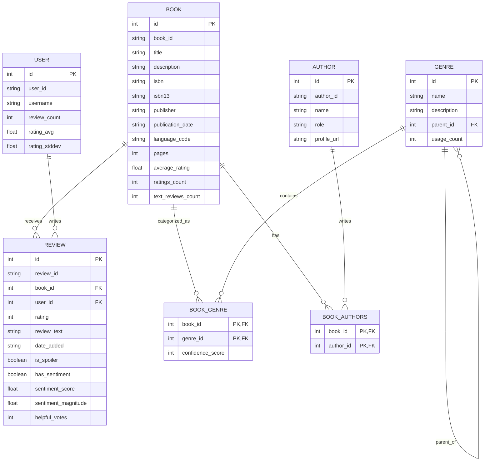

# Goodreads Analytics Tool

A data exploration application for Goodreads book data. Analyze books, authors, users, reviews, and genres from the UCSD Book Graph dataset.

## Getting Started

### Prerequisites

- Python 3.8+
- PyQt6
- SQLite3
- 15+ GB of disk space for the full dataset

### Installation

1. Clone the repository:
   ```bash
   git clone https://github.com/mdb42/goodreads.git
   cd goodreads
   ```

2. Create and activate a virtual environment:
   ```bash
   python -m venv venv
   source venv/bin/activate  # On Windows: venv\Scripts\activate
   ```

3. Install dependencies:
   ```bash
   pip install -r requirements.txt
   ```

### Running the Application

Launch the application:
   ```bash
   python main.py
   ```

The first time you run the application, you'll need to download the dataset files and initialize the database. Follow the setup wizard to complete this process.

## Features

- **Setup Wizard**: Guides you through downloading and importing the dataset
- **Data Browser**: Explore all database tables and relationships
- **Search**: Filter data in any table
- **Visualization**: Analyze relationships between books, authors, and reviews

## Database Schema



## Dataset Statistics

Our database currently contains:
- 2,360,655 books
- 829,529 authors (with IDs only, names are placeholders)
- 3,318,768 book-author relationships
- 18,892 users
- 1,330,981 reviews
- 1,591,786 unique genres/shelves (user-defined tags)
- 128,789,028 book-genre relationships

## Current Limitations

- **Author Data**: The dataset only provides author IDs without names. We use placeholder names like "Author_123456" until real names can be retrieved.
- **Interaction Data**: The interactions dataset is quite large (10+ GB) and may require additional system resources to process.
- **Performance**: Some queries, especially across the book-genre relationships, may be slow due to the dataset size.

## Next Steps

Planned enhancements:
- Advanced analytics for finding trends in user behavior
- Sentiment analysis of reviews
- Finding the most negative reviewer on Goodreads
- Genre clustering using machine learning
- Visualization dashboards for key metrics

## License

This project is licensed under the GNU General Public License due to PyQt6 requirements.

## Acknowledgments

- [UCSD Book Graph Dataset](https://sites.google.com/eng.ucsd.edu/ucsdbookgraph/home) for providing the rich dataset
- Julian McAuley and the UCSD research team for creating the dataset
- PyQt6 for the UI framework

## Citation

If you use this tool or the underlying dataset for research, please cite:
```
Mengting Wan, Julian McAuley, "Item Recommendation on Monotonic Behavior Chains", in RecSys'18.

Mengting Wan, Rishabh Misra, Ndapa Nakashole, Julian McAuley, "Fine-Grained Spoiler Detection from Large-Scale Review Corpora", in ACL'19.
```