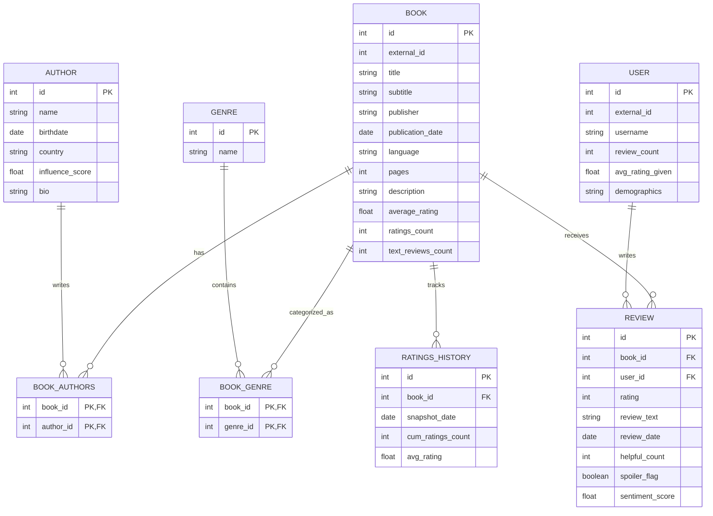

# Goodreads Analytics Tool

A data exploration application for Goodreads book data. Analyze books, authors, users, reviews, and genres.

## Getting Started

### Prerequisites

- Python 3.8+
- PyQt6
- SQLite3
- Kaggle API credentials (for dataset download)
- A dream and a prayer

### Installation

1. Clone the repository:
   ```bash
   git clone https://github.com/yourusername/goodreads-analytics.git
   cd goodreads-analytics
   ```

2. Create and activate a virtual environment:
   ```bash
   python -m venv venv
   source venv/bin/activate  # On Windows: venv\Scripts\activate
   ```

3. Install dependencies:
   ```bash
   pip install -r requirements.txt
   ```

4. Set up your Kaggle credentials:
   - Go to your Kaggle account settings
   - Create an API token and download kaggle.json
   - Place it in ~/.kaggle/ (Linux/Mac) or %USERPROFILE%\.kaggle\ (Windows)
   - Set appropriate permissions (`chmod 600 ~/.kaggle/kaggle.json` on Linux/Mac)

### Running the Application

1. Import the data (first-time setup):
   ```bash
   python main.py --rebuild-db
   ```
   This will download the Goodreads dataset and populate the database, assuming you have established Kaggle credentials.

2. Launch the application:
   ```bash
   python main.py
   ```

## Database Schema



## Current Data Gaps

I'm still missing quite a bit of data:

- **Author table**: Only has names, missing birthdate, country, influence_score, and bio
- **Book table**: Missing subtitle, publisher, publication_date, pages, description
- **Review table**: Missing the actual review text (kind of important for sentiment analysis)
- **User table**: Missing average rating and demographics
- **Genre table**: Full of weird user tags that make little sense

## Next Steps

Ideas I'm contemplating:

- Web crawling to fill in the missing data
- Calculating a proper influence score for authors
- Finding the single most negative reviewer on Goodreads (and analyzing their dark, bitter soul)
- Figuring out why some people tag books with "100-bullets" and what that even means
- Making pretty charts to justify all this work

## License

This project is licensed under the GNU General Public License due to PyQt6 requirements. See [LICENSE.md](LICENSE.md) for the legalese. TL;DR: You can use, modify, and distribute this software, but if you make changes, you need to share them under the same license.

## Acknowledgments

- My CPU, for not melting
- The Goodreads community, for their questionable tagging system
- Caffeine, the true hero of this project